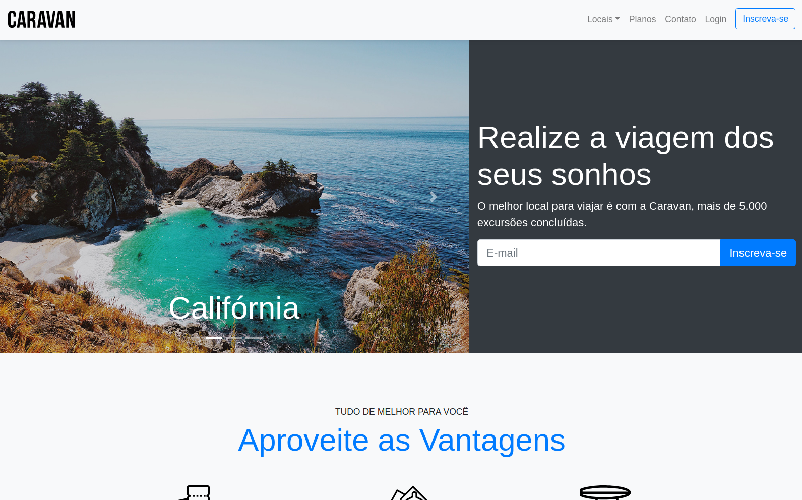

# Caravan
Site de destinos de viagem e passeios fictício, desenvolvido utilizando os recursos do Bootstrap 4, aproveitando ao máximo suas classes e componentes para garantir uma experiência responsiva e visualmente atrativa em diferentes dispositivos, desde desktops até smartphones. Navegue por ele clicando [aqui](https://caravan-mariag.netlify.app/).

## Imagens

## Objetivo
- Colocar em prática o aprendizado adquirido do Bootstrap 4.

## Funcionalidade
- Responsividade;
- Fácil leitura para leitores de tela.

## Tecnologias utilizadas
- HTML;
- CSS;
- Bootstrap.